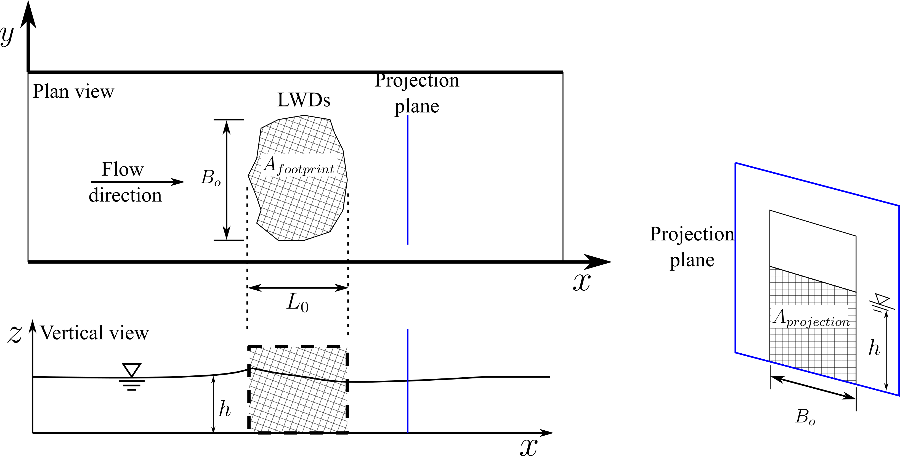

# Flow Resistance Parameterization for Large Woody Debris in 2D Depth-Averaged Models

This repository has data, simulation case setups, and processing scripts for the following papers 

* "Large Woody Debris Flow Resistance Parameterization in Two-Dimensional Depth-Averaged Models" 
* "Modeling Large Woody Debris: A Comparison between SRH-2D and HEC-RAS 2D" 

The setup of the problem is shown in the figure below.

<p align="center">
  
  <br>
  <em>Figure 1: Schematic diagram of flow partition due to a porous structure in an open channel.</em>
</p>

 The governing equations for most 2D depth-averaged models are as follows:

$$\frac{\partial h}{\partial t} + \frac{\partial h u}{\partial x} + \frac{\partial h v}{\partial y} =0 $$

$$ \frac{\partial h u}{\partial t} + \frac{\partial h u u}{\partial x} + \frac{\partial h u v}{\partial y} =  \frac{\partial h {T_{xx}}}{\partial x}+\frac{\partial h {T_{xy}}}{\partial y}-gh\frac{\partial \left(h+z_b\right)}{\partial x}-\frac{\tau_{bx}}{\rho} - \frac{F_{D,x}}{\rho A_{footprint}}$$

$$\frac{\partial h v}{\partial t} + \frac{\partial h uv}{\partial x} + \frac{\partial h v v}{\partial y} =  \frac{\partial h{T_{xy}}}{\partial x}+\frac{\partial h {T_{yy}}}{\partial y}-gh\frac{\partial \left(h+z_b\right)}{\partial y}-\frac{\tau_{by}}{\rho} - \frac{F_{D,y}}{\rho A_{footprint}}$$

The bed shear stresses, $\tau_{bx}$ and $\tau_{by}$, can be computed with the Manning’s resistance equation as:

$$(\tau_{bx}, \tau_{by}) = \rho C_f \sqrt{u^2+v^2}(u,v)$$ 

where $\rho$ is the density of water, $C_f = g n^2/h^{1/3}$, and $n$ is the Manning’ s roughness coefficient. The drag forces in the momentum equations above can be computed as: 

$$(F_{D,x}, F_{D,y}) = \frac{1}{2} C_d \rho A_{projection} \sqrt{u^2 + v^2} (u,v)$$

where $A_{projection}$ is the projected area of the LWD on the projection plane which is perpendicular to the flow direction. 

This work deals with the question of how to parameterize the LWD-induced flow resistance using the Manning's $n$ and the drag coefficient $C_d$ (or anything equivalent). A modeler can choose to use either $C_d$ or Manning's $n$ to represent LWD flow resistance, which essentially are equivalent, though they come from different concept.

The parameter values in this work are determined through the calibration process using the Gaussian Process Optimization. The calibration data are from flume experiments.  

## Prerequisites

### Clone the repository

```bash
git clone https://github.com/psu-efd/LWD_flow_resistance.git
cd LWD_flow_resistance
```

### Create a conda environment
The following command creates a conda environment using the `environment.yml` file. All necessary packages are included in the `environment.yml` file, except for `pyHMT2D`.

```bash
conda env create -f environment.yml
```

### Install pyHMT2D
Install the latest version of `pyHMT2D` from the GitHub repository. `pyHMT2D` is a Python package for automating computational hydraulics modeling. In this work, it is used to preprocess, run, and postprocess the 1,000 SRH-2D simulation cases. You will also need to install SRH-2D, for example, installing SMS from Aquaveo, which comes with the SRH-2D solver.

```bash
pip install git+https://github.com/psu-efd/pyHMT2D.git
```

## Computational Models
Two popular models, i.e., SRH-2D by USBR and HEC-RAS 2D v6.6 by USACE were adopted in this work. 

### SRH-2D Simulations

The SRH-2D simulation cases are in `SRH-2D` folder, which contains the following subfolders:

* `Cd_approach_w_turb`: with the drag approach and turbulence model is on
* `Cd_approach_wo_turb`: with the drag approach and turbulence model is off (with a very small turbulent model parameter)
* `Cd_approach_mesh_effect`: with the drag approach and different mesh resolutions to study the effect of mesh
*  `ManningN_approach_w_turb`: with the Manning's $n$ approach and turbulence model is on
* `ManningN_approach_wo_turb`: with the Manning's $n$ approach and turbulence model is off (with a very small turbulent model parameter)
* `Manning_approach_mesh_effect`: with the Manning's $n$ approach and different mesh resolutions to study the effect of mesh
* `exp_comp_plotting`: plotting scripts for generating the paper "Large Woody Debris Flow Resistance Parameterization in Two-Dimensional Depth-Averaged Models".

In each of the folders, the setup for each of the sixteen cases is in its own subdirectory. For example, `Exp_1_Cd` has the case and python script for Experiment \#1 using the $C_d$ approach. The python scripts within automate the calibration process using the Gaussian Process Optimization. Once the optimized parameter value is found, all cases can be run again using the optimal values and the results are postprocess for further analysis and plotting. Notably, the SRH-2D results are converted to VTK format using the `pyHMT2D` library.

### HEC-RAS 2D Simulations

Simulation cases are organized in HEC-RAS project using simulation plans. HEC-RAS version 6.6 is used because this is the first version that supports the additional drag term. The content within the folder `HEC_RAS_2D` is similar to the `SRH_2D` folder.

## Processing and Plotting

Processing and the generation of most of the figures in the papers are done through python scripts. There are two places:

* `SRH_2D/exp_comp_plotting`: for the paper "Large Woody Debris Flow Resistance Parameterization in Two-Dimensional Depth-Averaged Models"
* `plotting_SRH_vs_RAS`: for the paper "Modeling Large Woody Debris: A Comparison between SRH-2D and HEC-RAS 2D"

## License

MIT License

## Contact

Xiaofeng Liu, Ph.D., P.E.

Department of Civil and Environmental Engineering

Institute of Computational and Data Sciences

Penn State University

Web: https://water.engr.psu.edu/liu/

Email: xiaofengliu19@gmail.com

For questions and support, please open an issue in the repository.